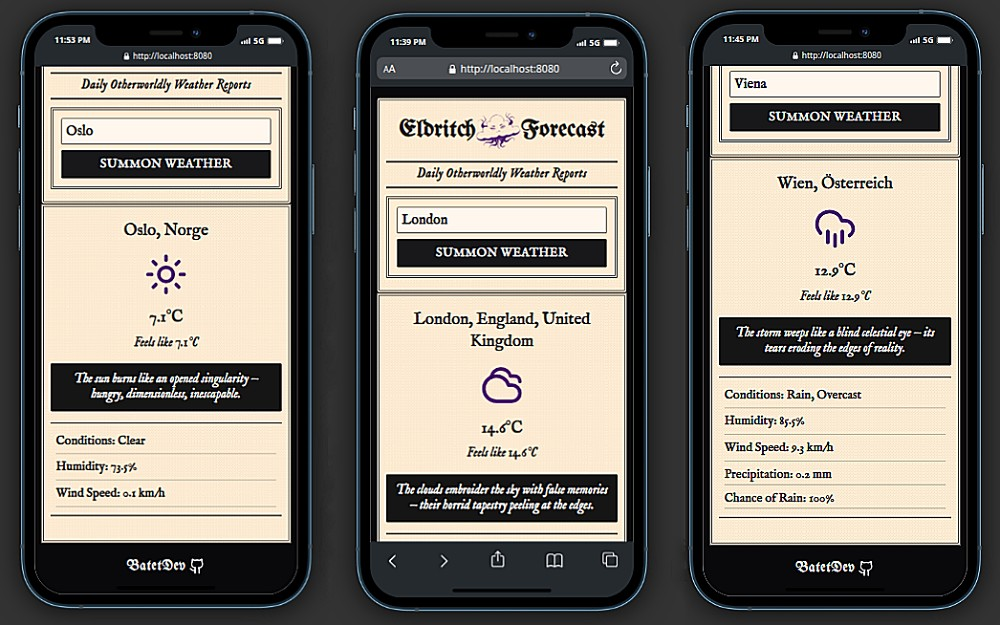

# Eldritch Forecast

<div align="center">



## A Cosmic Horror Doom-Lit Weather App

**Built with:**

[](https://developer.mozilla.org/en-US/docs/Web/HTML)
[](https://developer.mozilla.org/en-US/docs/Web/CSS)
[](https://developer.mozilla.org/en-US/docs/Web/JavaScript)
[](https://webpack.js.org/)
[](https://tailwindcss.com/)

</div>

[Live Demo](https://batetdev.github.io/top-project-weather-app/) · [View Code](https://github.com/BatetDev/top-project-weather-app/tree/main)

---

## About

A weather app that fetches real-time data from the Visual Crossing API and renders them with **doom-lit descriptions**, **Lucide icons**, and an **Vintage Gazette-style UI**.

Built as part of The Odin Project’s JavaScript curriculum, this project emphasizes:

- Modular structure
- Async/await logic
- Visual Crossing API integration
- TailwindCSS styling

---

## 🌫️ Key Features

- ✅ Fetch current weather for any city
- 📦 Modular JavaScript architecture
- 🌑 Cosmic Horror doom-lit descriptions for every condition
- 🌩 Dynamic icon mapping via Lucide Icons
- 💧 Precipitation chance + amount display
- 📱 Mobile-first responsive design

---

## 🛠 Built With

- **HTML5** for structure
- **TailwindCSS v4** for styling and layout
- **JavaScript (ES6+)** for functionality
- **Webpack 5** for module bundling
- **Lucide Icons** for scalable vector icons
- **Visual Crossing Weather API** for real-world weather data
- **Leonardo AI** for logo design
- **Hero Patterns** for gazette background pattern

---

## 🧪 Getting Started

To run this project locally:

```bash
# Clone the repository
git clone https://github.com/BatetDev/top-project-weather-app.git

# Navigate to project directory
cd top-project-weather-app

# Install dependencies
npm install

# Run development server
npm run dev

# Build for production
npm run build

# Deploy to gh-pages
npm run publish

## Credits

- Original project by: [The Odin Project](https://www.theodinproject.com/lessons/node-path-javascript-weather-app)
- Weather Data API by: [Visual Crossing](https://www.visualcrossing.com/weather-api/)
- Icons: [Lucide Icons](https://lucide.dev/)
- Background pattern by: [Hero Patterns](https://heropatterns.com/)
- Logo generated with: [Leonardo.AI](https://leonardo.ai/)
```
